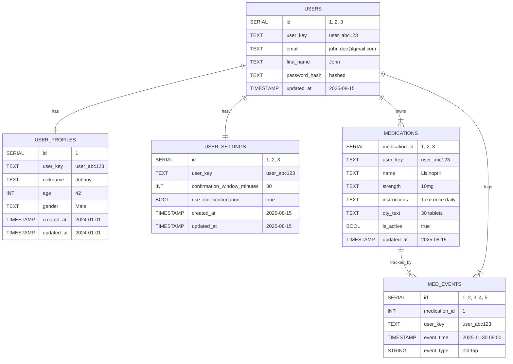

streaks

```mermaid
erDiagram
    USERS {
        SERIAL id "1, 2, 3"
        TEXT user_key "user_abc123"
        TEXT email "john.doe@gmail.com"
        TEXT first_name "John"
        TEXT password_hash "hashed"
        TIMESTAMP updated_at "2025-08-15"
    }
    USER_PROFILES {
        SERIAL id "1"
        TEXT user_key "user_abc123"
        TEXT nickname "Johnny"
        INT age "42"
        TEXT gender "Male"
        TIMESTAMP created_at "2024-01-01"
        TIMESTAMP updated_at "2024-01-01"
    }
    USER_SETTINGS {
        SERIAL id "1, 2, 3"
        TEXT user_key "user_abc123"
        INT confirmation_window_minutes "30"
        BOOL use_rfid_confirmation "true"
        TIMESTAMP created_at "2025-08-15"
        TIMESTAMP updated_at "2025-08-15"
    }
    MEDICATIONS {
        SERIAL medication_id "1, 2, 3"
        TEXT user_key "user_abc123"
        TEXT name "Lisinopril"
        TEXT strength "10mg"
        TEXT instructions "Take once daily"
        TEXT qty_text "30 tablets"
        BOOL is_active "true"
        TIMESTAMP updated_at "2025-08-15"
    }
    MED_EVENTS {
        SERIAL id "1, 2, 3, 4, 5"
        INT medication_id "1"
        TEXT user_key "user_abc123"
        TIMESTAMP event_time "2025-11-30 08:00"
        STRING event_type "rfid-tap"
    }

    USERS ||--|| USER_PROFILES : has
    USERS ||--|| USER_SETTINGS : has
    USERS ||--|{ MEDICATIONS : owns
    MEDICATIONS ||--|{ MED_EVENTS : tracked_by
    USERS ||--|{ MED_EVENTS : logs
```
